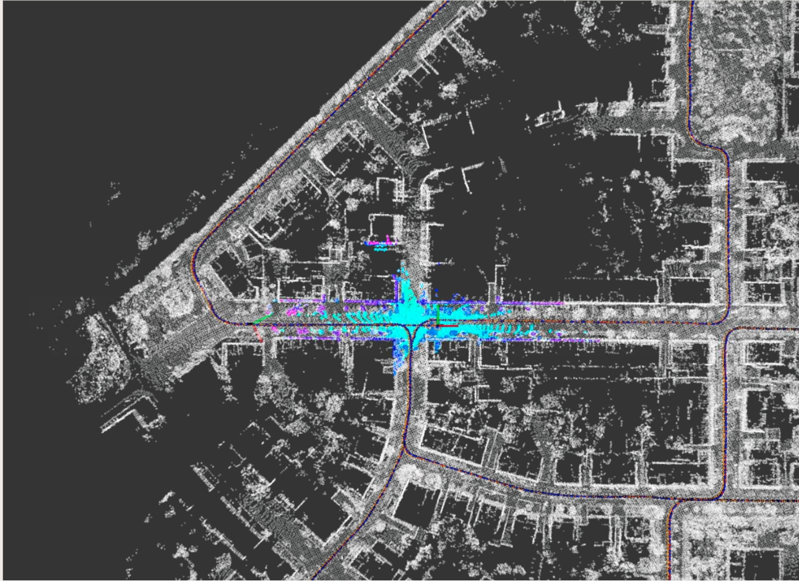
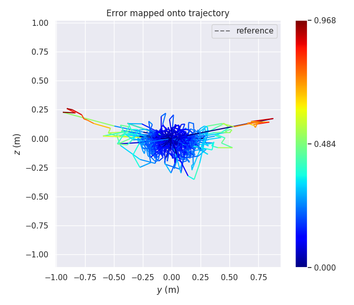
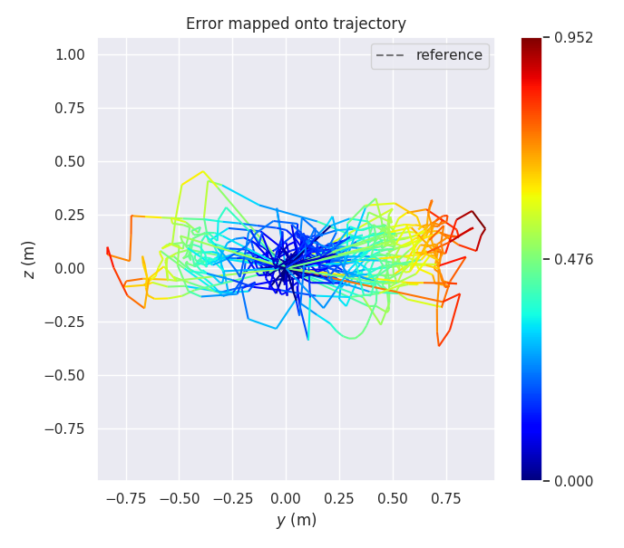
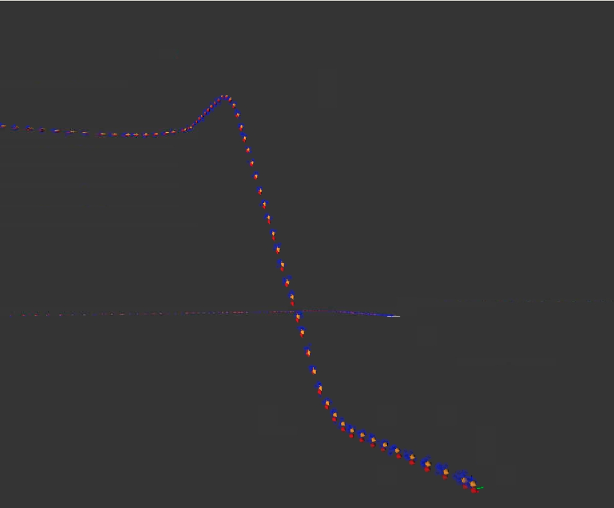
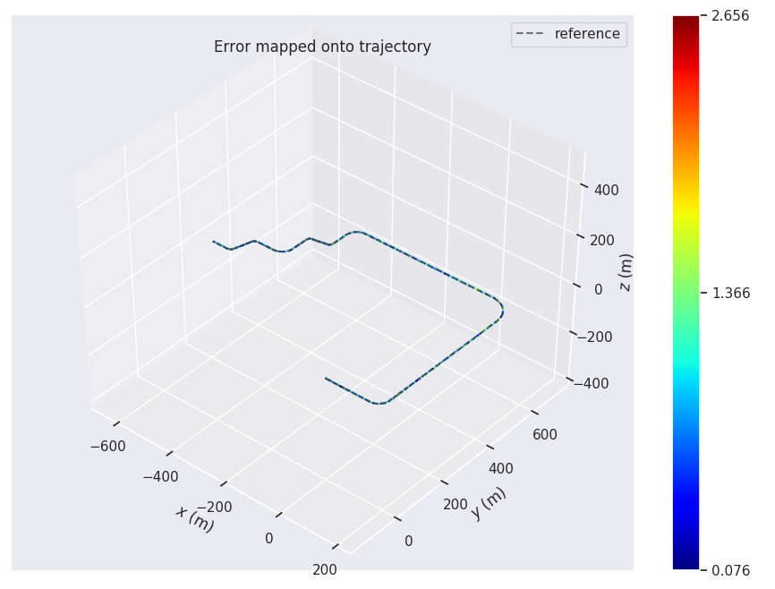
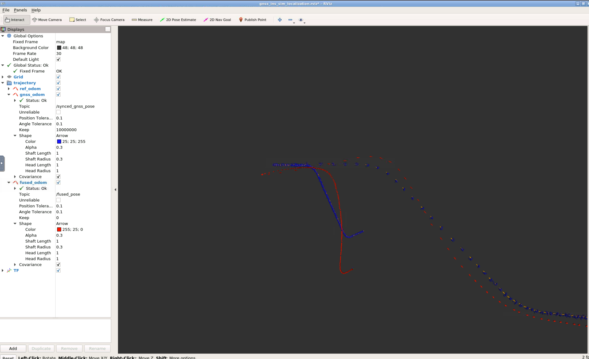
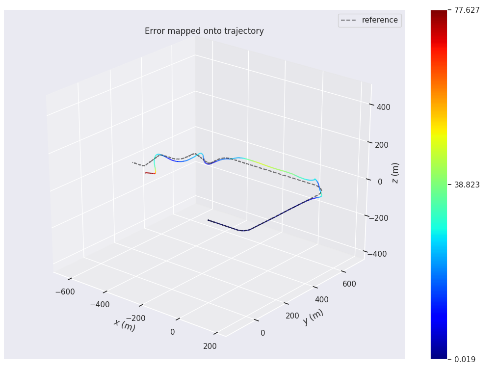

## 实现新模型,且功能正常
所给的代码框架是导航坐标系下的误差传播方程对应的框架，按照课件中的公式，将
整个框架换成是本体坐标系下的误差传播方程对应的框架
[更改Y、G和C矩阵](https://github.com/bulinx/bulinx-08-filtering-advanced/blob/3f023ba4fece5b10e43fc37a9fc11a8549f05e23/src/lidar_localization/src/models/kalman_filter/error_state_kalman_filter.cpp#L736)
结果如下：

## 实现新模型,且部分路段性能有改善
[News](https://github.com/bulinx/bulinx-08-filtering-advanced/blob/3f023ba4fece5b10e43fc37a9fc11a8549f05e23/src/lidar_localization/src/models/kalman_filter/error_state_kalman_filter.cpp#L746)
结果如下：

若不考虑运动模型：

## 在良好的基础上,增加编码器融合的内容
增加编码器融合
[更改Y、G和C矩阵](https://github.com/bulinx/bulinx-08-filtering-advanced/blob/3f023ba4fece5b10e43fc37a9fc11a8549f05e23/src/lidar_localization/src/models/kalman_filter/error_state_kalman_filter.cpp#L791)

结果如下：

不考虑编码器融合：
[ignore](https://github.com/bulinx/bulinx-08-filtering-advanced/blob/3f023ba4fece5b10e43fc37a9fc11a8549f05e23/src/lidar_localization/src/models/kalman_filter/error_state_kalman_filter.cpp#L685)

结果如下：

